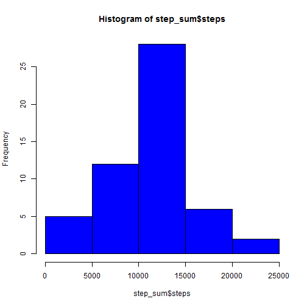
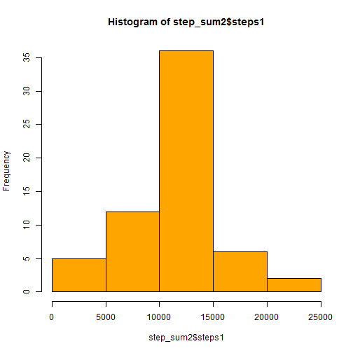
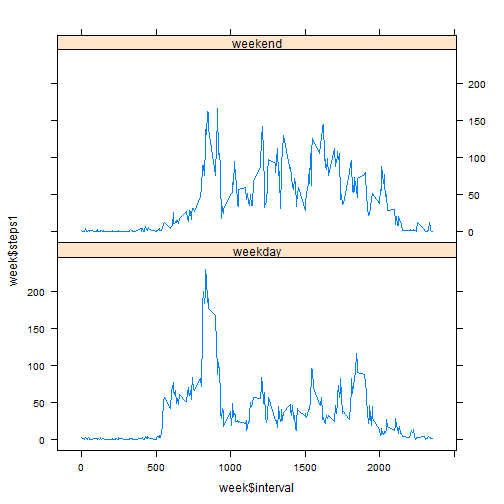

## Loading and preprocessing the data

```r
activity <- read.csv("Z:/Ferguson 13 march/other assignment/DS/Coursera/Courses/Reproducible research/Assignment/Assignment 1/Data/activity.csv")
```
Process/transform the data


```r
activity$date <- as.Date(activity$date,"%d-%m-%y")
activity <- na.omit(activity)
```
##What is mean total number of steps taken per day?

Calculate the total number of steps taken per day

```r
step_sum <- aggregate(steps ~ date, activity, sum)
print(step_sum)
```

```
##          date steps
## 1  2012-10-02   126
## 2  2012-10-03 11352
## 3  2012-10-04 12116
## 4  2012-10-05 13294
## 5  2012-10-06 15420
## 6  2012-10-07 11015
## 7  2012-10-09 12811
## 8  2012-10-10  9900
## 9  2012-10-11 10304
## 10 2012-10-12 17382
## 11 2012-10-13 12426
## 12 2012-10-14 15098
## 13 2012-10-15 10139
## 14 2012-10-16 15084
## 15 2012-10-17 13452
## 16 2012-10-18 10056
## 17 2012-10-19 11829
## 18 2012-10-20 10395
## 19 2012-10-21  8821
## 20 2012-10-22 13460
## 21 2012-10-23  8918
## 22 2012-10-24  8355
## 23 2012-10-25  2492
## 24 2012-10-26  6778
## 25 2012-10-27 10119
## 26 2012-10-28 11458
## 27 2012-10-29  5018
## 28 2012-10-30  9819
## 29 2012-10-31 15414
## 30 2012-11-02 10600
## 31 2012-11-03 10571
## 32 2012-11-05 10439
## 33 2012-11-06  8334
## 34 2012-11-07 12883
## 35 2012-11-08  3219
## 36 2012-11-11 12608
## 37 2012-11-12 10765
## 38 2012-11-13  7336
## 39 2012-11-15    41
## 40 2012-11-16  5441
## 41 2012-11-17 14339
## 42 2012-11-18 15110
## 43 2012-11-19  8841
## 44 2012-11-20  4472
## 45 2012-11-21 12787
## 46 2012-11-22 20427
## 47 2012-11-23 21194
## 48 2012-11-24 14478
## 49 2012-11-25 11834
## 50 2012-11-26 11162
## 51 2012-11-27 13646
## 52 2012-11-28 10183
## 53 2012-11-29  7047
```
Make a histogram of the total number of steps taken each day

```r
hist(step_sum$steps, col = "blue")
```

 
Calculate and report the mean and median of the total number of steps taken per day

```r
mean(step_sum$steps)
```

```
## [1] 10766.19
```

```r
median(step_sum$steps)
```

```
## [1] 10765
```

* The Mean of the total numner of steps taken per day is 10766.19
* The Median of the total numner of steps taken per day is 10765

##What is the average daily activity pattern?
Make a time series plot


```r
library(ggplot2)
max <- aggregate(steps ~ interval, activity, mean)
g <- ggplot(max,aes(interval, steps))
g <- g + geom_line()
print(g)
```

 

Which 5-minute interval, on average across all the days in the dataset, contains the maximum number of steps?


```r
max[which.max(max$steps), ]
```

```
##     interval    steps
## 104      835 206.1698
```
* Interval 835 has the highest average number of steps i.e 206.17


##Imputing missing values
Calculate and report the total number of missing values in the dataset


```r
activity <- read.csv("Z:/Ferguson 13 march/other assignment/DS/Coursera/Courses/Reproducible research/Assignment/Assignment 1/Data/activity.csv")
sum(is.na(activity$steps))
```

```
## [1] 2304
```
* There are 2304 missing values

Devise a strategy for filling in all of the missing values in the dataset

* My strategy uses the mean for that 5-minute interval


```r
library(zoo, quietly = TRUE)
activity$steps1 <- na.aggregate(activity$steps, by = activity$interval, FUN = mean)
```
Create a new dataset that is equal to the original dataset but with the missing data filled in.

```r
activity2 <- activity[c(4,2,3)]
```
Make a histogram of the total number of steps taken each day

```r
step_sum2 <- aggregate(steps1 ~ date, activity2, sum)
hist(step_sum2$steps1, col = "orange")
```

 


```r
mean(step_sum2$steps1)
```

```
## [1] 10766.19
```

```r
median(step_sum2$steps1)
```

```
## [1] 10766.19
```
* The mean is same i.e. 10766.19 after imputing the missing values.
* There is a difference of 1.9 steps between the median after imputing the missing values

##Are there differences in activity patterns between weekdays and weekends?

Create a new factor variable in the dataset with two levels - "weekday" and "weekend"


```r
activity2$date <- as.Date(activity2$date,"%d-%m-%y")
activity2["week_type"] <- NA
activity2$week_type <- weekdays(activity2$date)
activity2$week_type <- ifelse(activity2$week_type =="Saturday" |activity2$week_type == "Sunday","weekend","weekday" )
activity2$week_type <- as.factor(activity2$week_type)
```
Make a panel plot containing a time series plot


```r
library(lattice)
week <- aggregate(steps1 ~ interval + week_type, activity2, mean)
xyplot(week$steps1 ~ week$interval | week$week_type, layout = c(1,2), type = "l")
```

 

* There are more fluctuation during the weekends than weekdays. However, the highest numners of steps results during the weekdays bwtween the interval of 800 to 900. 
